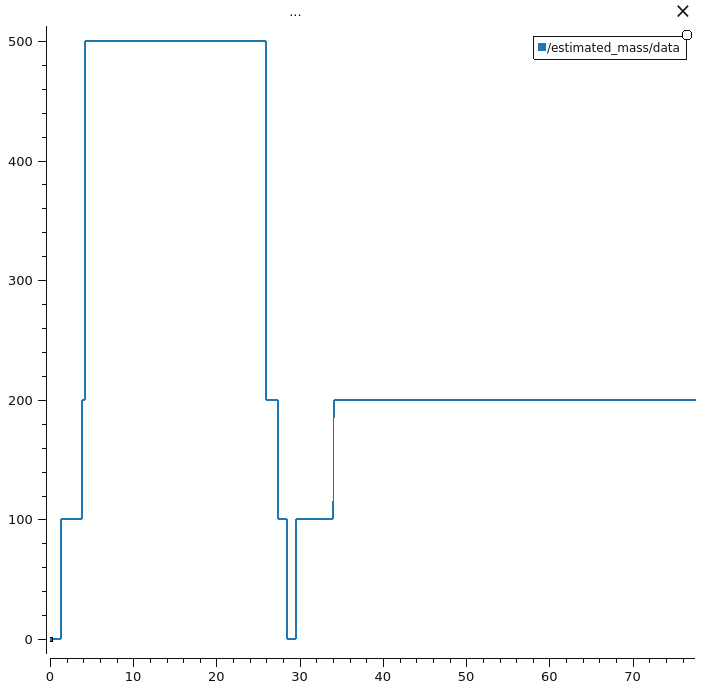

# Weight Detection Module

ROS2 Humble package for estimating payload weight held by the UR5e end-effector using joint torque measurements.

## Overview

This node estimates the mass of an object held by the robot by measuring the change in joint torques compared to a calibrated baseline, then applying physics-based calculations using the robot's kinematics.

These calculations are a series of torque calculations ($mass$ $\times$ $gravity$ $\times$ $radius$) transformed to the coordinate frame of the active joints.

## Interfaces

### Subscriptions
Requires Universal Robots' `ur_robot_driver`.

| Topic | Type | Description |
|-------|------|-------------|
| `/joint_states` | `sensor_msgs/msg/JointState` | Joint positions and effort (torque) values for all 6 joints |

### Publishers
| Topic | Type | Description |
|-------|------|-------------|
| `/estimated_mass` | `std_msgs/msg/Int32` | Estimated mass in grams |
| `/weight_detection/calibration_status` | `std_msgs/msg/Bool` | `true` while calibrating, `false` when ready |

### Services
| Service | Type | Description |
|---------|------|-------------|
| `/weight_detection/calibrate_baseline` | `sort_interfaces/srv/CalibrateBaseline` | Triggers baseline recalibration |
| | | &nbsp;&nbsp;&nbsp;&nbsp;Returns: `success` (bool), `message` (string), `wait_time_ms` (int32) |

### Parameters
| Parameter | Default | Description |
|-----------|---------|-------------|
| `useSnapping` | `false` | When `true`, snaps output to discrete weights (0, 50, 100, 200, 500g). When `false`, outputs continuous values rounded to nearest 5g. |

## How It Works

```
                              Baseline Torques
                                     ↓
Current Joint Torques → Kalman Filter → Torque Deltas → Kinematics → Mass Estimate → Calibration → Output
```

1. **Decimation**: Joint state messages arrive at ~500Hz; the node decimates to ~50Hz to reduce processing load / high frequency noise.
2. **Baseline Calibration**: On startup (or when triggered via service), the node collects ~5 seconds of torque samples to establish a baseline with the gripper empty.
3. **Torque Filtering**: Incoming joint torques are smoothed using per-joint Kalman filters.
4. **Mass Estimation**: The difference between current and baseline torques is used with UR5e forward kinematics to compute moment arms, then mass is estimated via $\tau = m \times g \times r$.
5. **Output Calibration**:
   - **Snapping ON** (`useSnapping: true`): Uses exponential calibration curves and snaps to the nearest weight class {0, 50, 100, 200, 500}g.
   - **Snapping OFF** (`useSnapping: false`): Uses polynomial calibration for more accurate continuous output, rounded to the nearest 5g.

## Usage
1. **Initiate Calibration**: Go to a fixed height above the target pickup point and invoke the `/weight_detection/calibrate_baseline` service.
2. **Calibration Wait Time**: The node requires ~5.5 seconds of baseline calibration on startup before producing estimates. Wait for `/weight_detection/calibration_status` to publish `false` before measurements are valid.
3. **Perform Pickup Manouevre**: Descend, pickup the weight, and raise back to baseline-calibrated joint pose .
4. **Read Estimation**: Wait ~10 seconds for noise to settle, and read `/estimated_mass` topic.
5. **Repeat**: Steps 1-4 for each weight estimation procedure.

### Compilation

```bash
colcon build --packages-select weight_detection_module
source install/setup.bash
ros2 run weight_detection_module weight_detector
```

#### Snapping Toggle
Enable:
```bash
ros2 run weight_detection_module weight_detector --ros-args -p useSnapping:=true
```
Disable:
```bash
ros2 run weight_detection_module weight_detector --ros-args -p useSnapping:=false
```

### Visualisation

Use **PlotJuggler** to monitor the estimated mass topic in real-time:

```bash
cd ./ros2_system  # Ensure you are in the 'ros2_system' directory
./plot_weight.sh
```

Click **'Yes'** in the "Start Streaming" popup, then **'Ok'**. The visualisation should appear.

We recommend changing the Buffer size (top left, under "Streaming") to **90 seconds**.

**Expected output**: A step plot showing mass estimates. With snapping enabled, you'll see discrete jumps between weight classes. With snapping disabled, you'll see smoother transitions.



#### Alternative: Python Node
**WARNING**: Only intended for visualisation of torque filtering on all 6 robot joints as this uses an outdated estimator.
```bash
ros2 run weight_detection_module weight_detector_py.py
```

## Limitations and Assumptions

- **Calibration delay**: The node requires ~5.5 seconds of baseline calibration on startup before producing estimates. Wait for `/weight_detection/calibration_status` to publish `false` before measurements are valid.
- **Recalibration required**: If the gripper or tool changes, call the calibration service to re-establish the baseline.
- **Fixed baseline pose**: Gripper must return to the exact joint pose where calibration occurred for accurate estimates.
- **Known weight set**: Snapping mode assumes payloads are one of {0, 50, 100, 200, 500} grams. For arbitrary weights, disable snapping for more accurate continuous estimates.
